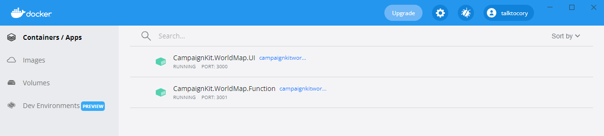
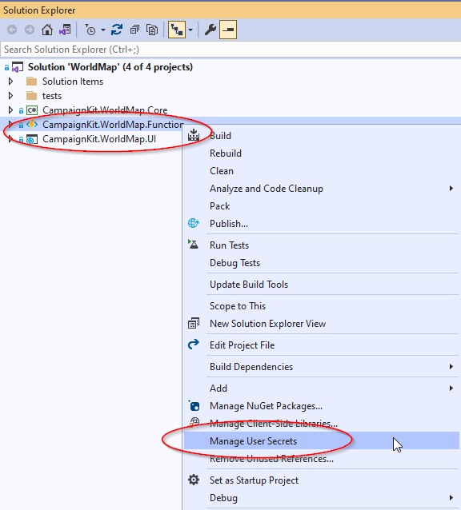

# world-map

Service for managing world maps and associate them with Campaign Logger log entries.

# Development Environment

## SDKs

- [.Net 5.0 SDK](https://dotnet.microsoft.com/download/visual-studio-sdks?utm_source=getdotnetsdk&utm_medium=referral)

## Azure Tools
- [Microsoft Azure Storage Explorer](https://azure.microsoft.com/en-us/features/storage-explorer/)
- [Microsoft Azure Storage Emulator](https://docs.microsoft.com/en-us/azure/storage/common/storage-use-emulator)

## Visual Studio
- [VS2019 Community](https://visualstudio.microsoft.com/downloads/)
- Workloads
  - ASP.NET and web development
  - .Net Core cross-platform development
  - Node.js development

## Visual Studio Extensions
- [Markdown Editor](https://marketplace.visualstudio.com/items?itemName=ChrisDahlberg.StyleCop)
- [GhostDoc](https://marketplace.visualstudio.com/items?itemName=sergeb.GhostDoc)
- [GitFlow](https://marketplace.visualstudio.com/items?itemName=vs-publisher-57624.GitFlowforVisualStudio2019)
- [GitHub](https://marketplace.visualstudio.com/items?itemName=GitHub.GitHubExtensionforVisualStudio)
- [Web Compiler](https://marketplace.visualstudio.com/items?itemName=MadsKristensen.WebCompiler)

## Docker
- [Docker](https://docs.docker.com/docker-for-windows/install/)
 
## Azure Storage Emulator
The Azure Storage Emulator is used by the application to simulate reading/writing from Azure storage in the local environment.  See: [Running the Azure Storage Emulator](https://medium.com/oneforall-undergrad-software-engineering/setting-up-the-azure-storage-emulator-environment-on-windows-5f20d07d3a04)

Ensure that the following Azure Storage items have been created:
- **world-map** blob container
  - public read access for blobs only
- **worldmapqueue** message queue for maps
- **worldmapmaps** table
- **worldmaptiles** table
 
Setting up blob containers, message queues and tables.


Enabling public access to blobs.


# Running and Debugging the Application Natively

## Docker Desktop
1. Start Docker Desktop
2. Click "Start" to begin debugging.  This will build and run the following Docker image:
  - CampaignKit.WorldMap.UI



## User Secrets
Both the **CampaignKit.WorldMap.Function** and **CampaignKit.WorldMap.UI** projects make use of ASP.Net Core's user secrets functionality to override values in **local.settings.json** and **appsettings.json** respectively.  Visual Studio has built in support for user secrets that you can use to provide configuration overrides during development.



Once you open your user secrets file you can provide local configuration overrides that don't get stored in the code repository.

```
{
  "ConnectionStrings:AzureTableStorageTiles": "TableEndpoint=https://clst03.table.core.windows.net/;SharedAccessSignature=...",
  "ConnectionStrings:AzureTableStorageMaps": "TableEndpoint=https://clst03.table.core.windows.net/;SharedAccessSignature=...",
  "ConnectionStrings:AzureQueueStorage": "QueueEndpoint=https://clst03.queue.core.windows.net/;SharedAccessSignature=...",
  "ConnectionStrings:AzureBlobStorage": "BlobEndpoint=https://clst03.blob.core.windows.net/;SharedAccessSignature=...",
  "AzureBlobBaseURL": "https://clst03.blob.core.windows.net/world-map"
}
```


# Reference Material

## OpenID Connect

- [OpenID Connect JavaScript Client library](https://github.com/IdentityModel/oidc-client-js)
- [Using JWT and Asp.Net Core Cookies](https://amanagrawal.blog/2017/09/18/jwt-token-authentication-with-cookies-in-asp-net-core/)
- [IdentityServer4 Examples](https://github.com/IdentityServer/IdentityServer4.Samples)
- [IdentityServer4 QuickStart - Adding User Authentication with OpenID Connect](http://docs.identityserver.io/en/latest/quickstarts/3_interactive_login.html)
- [IdentityServer4 JavaScript Client Quickstart](http://docs.identityserver.io/en/latest/quickstarts/6_javascript_client.html)
- [Configuring App to Recognize JWT authorization tokens](https://developer.okta.com/blog/2018/03/23/token-authentication-aspnetcore-complete-guide)

## Testing
- [Unit Testing Controllers in ASP.Net Core](https://docs.microsoft.com/en-us/aspnet/core/mvc/controllers/testing?view=aspnetcore-5.0)
- [Integration Testing in ASP.Net Core](https://docs.microsoft.com/en-us/aspnet/core/test/integration-tests?view=aspnetcore-5.0)
- [Integration Testing with OpenID Connect](https://github.com/stottle-uk/IntegrationTestingWithIdentityServer)
- [Mocking authentication in integration tests](https://github.com/jackowild/aspnetcore-bypassing-authentication/tree/master/MockingAuthApi)
- [Supporting AntiForgeryTokens](https://www.matheus.ro/2018/09/03/integration-tests-in-asp-net-core-controllers/)

## Azure

- [Azure Storage Blobs - Quickstart](https://docs.microsoft.com/en-us/azure/storage/blobs/storage-quickstart-blobs-dotnet)
- [Cosmos DB - Quickstart](https://docs.microsoft.com/en-us/azure/cosmos-db/create-table-dotnet)
- [Cosmos DB - Query Tables](https://docs.microsoft.com/en-us/azure/cosmos-db/tutorial-query-table)
- [Cosmos DB - Query Examples](https://docs.microsoft.com/en-us/azure/cosmos-db/sql-api-dotnet-v3sdk-samples#query-examples)
- [Azure Connection Strings](https://docs.microsoft.com/en-us/azure/storage/common/storage-configure-connection-string)
- [Configuring Logging in Azure App Service](https://ardalis.com/configuring-logging-in-azure-app-services/)
- [Develop, test, and deploy an Azure Function with Visual Studio](https://docs.microsoft.com/en-us/learn/modules/develop-test-deploy-azure-functions-with-visual-studio/)
- [Use dependency injections in .Net Azure Functions](https://docs.microsoft.com/en-us/azure/azure-functions/functions-dotnet-dependency-injection)
- [Azure Functions Dependency Injection](https://blog.rasmustc.com/azure-functions-dependency-injection/)
- [Using JSON and User Secrets configuration with Azure Functions](https://dev.to/cesarcodes/using-json-and-user-secrets-configuration-with-azure-functions-3f7g)

## ASP.Net Core
- [ASP.Net User Secrets](https://docs.microsoft.com/en-us/aspnet/core/security/app-secrets?view=aspnetcore-5.0&tabs=windows)
- [Visual Studio Support for User Secrets](https://www.mssqltips.com/sqlservertip/6348/securely-manage-database-credentials-using-visual-studio-manage-user-secrets/)
