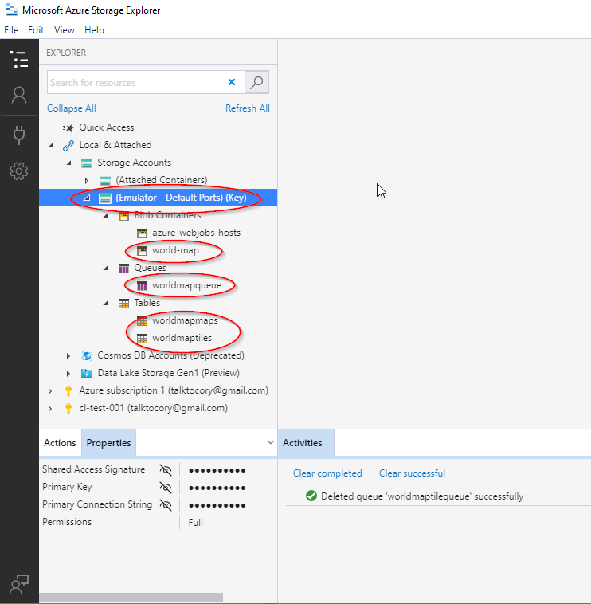

# world-map

Service for managing world maps and associate them with Campaign Logger log entries.

# Development Environment

## SDKs

- CampaignKit.WorldMap.UI
  - [.Net 5.0 SDK](https://dotnet.microsoft.com/download/visual-studio-sdks?utm_source=getdotnetsdk&utm_medium=referral)
- CampaignKit.WorldMap.Core and CampaignKit.WorldMap.Functions
  - [.Net 3.1 SDK](https://dotnet.microsoft.com/download/visual-studio-sdks?utm_source=getdotnetsdk&utm_medium=referral)

## Azure Tools
- [Microsoft Azure Storage Explorer](https://azure.microsoft.com/en-us/features/storage-explorer/)
- [Microsoft Azure Storage Emulator](https://docs.microsoft.com/en-us/azure/storage/common/storage-use-emulator)

## Visual Studio
- [VS2019 Community](https://visualstudio.microsoft.com/downloads/)
- Workloads
  - ASP.NET and web development
  - .Net Core cross-platform development
  - Node.js development

## Visual Studio Extensions
- [Markdown Editor](https://marketplace.visualstudio.com/items?itemName=ChrisDahlberg.StyleCop)
- [GhostDoc](https://marketplace.visualstudio.com/items?itemName=sergeb.GhostDoc)
- [GitFlow](https://marketplace.visualstudio.com/items?itemName=vs-publisher-57624.GitFlowforVisualStudio2019)
- [GitHub](https://marketplace.visualstudio.com/items?itemName=GitHub.GitHubExtensionforVisualStudio)
- [Web Compiler](https://marketplace.visualstudio.com/items?itemName=MadsKristensen.WebCompiler)

## Docker
- [Docker](https://docs.docker.com/docker-for-windows/install/)
- [Container Tools Build Properties](https://docs.microsoft.com/en-us/visualstudio/containers/container-msbuild-properties?view=vs-2019)
- [Container Tools Launch Settings](https://docs.microsoft.com/en-us/visualstudio/containers/container-launch-settings?view=vs-2019)
- [Server Environment Variables](https://docs.microsoft.com/en-us/aspnet/core/fundamentals/host/web-host?view=aspnetcore-5.0#server-urls)
 
## Azure Storage Emulator
The Azure Storage Emulator is used by the application to simulate reading/writing from Azure storage in the local environment.  See: [Running the Azure Storage Emulator](https://medium.com/oneforall-undergrad-software-engineering/setting-up-the-azure-storage-emulator-environment-on-windows-5f20d07d3a04)

Setting up blob containers, message queues and tables.

Enabling public access to blobs.

## Connection Strings
- Connection strings in `appsettings.Development.json` can be overwritten locally for testing against other sources.  Use the .Net Core User Secrets manager to make these overrides. See: [Working with User Secrets](https://docs.microsoft.com/en-us/aspnet/core/security/app-secrets?view=aspnetcore-5.0&tabs=windows).
- To setup connection string overrides locally:
  - Open **Tools > NuGet Package Manager > NuGet Package Manager Console**
  - `cd src\CampaignKit.WorldMap.UI`
  - `dotnet user-secrets init`
  - `dotnet user-secrets set "ConnectionStrings:AzureBlobStorage" "<YOUR CUSTOM CONNECTION STRING>"`
  - `dotnet user-secrets set "ConnectionStrings:AzureQueueStorage" "<YOUR CUSTOM CONNECTION STRING>"`
  - `dotnet user-secrets set "ConnectionStrings:AzureTableStorageMaps" "<YOUR CUSTOM CONNECTION STRING>"`
  - `dotnet user-secrets set "ConnectionStrings:AzureTableStorageTiles" "<YOUR CUSTOM CONNECTION STRING>"`
  - `dotnet user-secrets set "AzureBlobBaseURL" "<YOUR CUSTOM AZURE BLOB BASE URL>"`
  - `cd ..\CampaignKit.WorldMap.Function`
  - `dotnet user-secrets init`
  - `dotnet user-secrets set "ConnectionStrings:AzureBlobStorage" "<YOUR CUSTOM CONNECTION STRING>"`
  - `dotnet user-secrets set "ConnectionStrings:AzureQueueStorage" "<YOUR CUSTOM CONNECTION STRING>"`
  - `dotnet user-secrets set "ConnectionStrings:AzureTableStorageMaps" "<YOUR CUSTOM CONNECTION STRING>"`
  - `dotnet user-secrets set "ConnectionStrings:AzureTableStorageTiles" "<YOUR CUSTOM CONNECTION STRING>"`

To convert an Azure SAS URI into a connection string:
  - Your URI will have the following format: `https://<ACCOUNT>.<blob/table>.core.windows.net/<RESOURCE>?<SAS String>`
  - Reformat it as follows: `<BlobEndpoint\TableEndpoint>=https://<ACCOUNT>.<blob/table>.core.windows.net/;SharedAccessSignature=<SAS String>`
  - Note that the `<RESOURCE>` and `?` elements were dropped.

# Running the Application Natively

# Running the Application in Docker

# Deployment

Ensure that the startup command is set to `dotnet CampaignKit.WorldMap.UI.dll --urls "http://+:8080"`

# Reference Material

## OpenID Connect

- [OpenID Connect JavaScript Client library](https://github.com/IdentityModel/oidc-client-js)
- [Using JWT and Asp.Net Core Cookies](https://amanagrawal.blog/2017/09/18/jwt-token-authentication-with-cookies-in-asp-net-core/)
- [IdentityServer4 Examples](https://github.com/IdentityServer/IdentityServer4.Samples)
- [IdentityServer4 QuickStart - Adding User Authentication with OpenID Connect](http://docs.identityserver.io/en/latest/quickstarts/3_interactive_login.html)
- [IdentityServer4 JavaScript Client Quickstart](http://docs.identityserver.io/en/latest/quickstarts/6_javascript_client.html)
- [Configuring App to Recognize JWT authorization tokens](https://developer.okta.com/blog/2018/03/23/token-authentication-aspnetcore-complete-guide)

## Testing
- [Unit Testing Controllers in ASP.Net Core](https://docs.microsoft.com/en-us/aspnet/core/mvc/controllers/testing?view=aspnetcore-5.0)
- [Integration Testing in ASP.Net Core](https://docs.microsoft.com/en-us/aspnet/core/test/integration-tests?view=aspnetcore-5.0)
- [Integration Testing with OpenID Connect](https://github.com/stottle-uk/IntegrationTestingWithIdentityServer)
- [Mocking authentication in integration tests](https://github.com/jackowild/aspnetcore-bypassing-authentication/tree/master/MockingAuthApi)
- [Supporting AntiForgeryTokens](https://www.matheus.ro/2018/09/03/integration-tests-in-asp-net-core-controllers/)

## Azure

- [Azure Storage Blobs - Quickstart](https://docs.microsoft.com/en-us/azure/storage/blobs/storage-quickstart-blobs-dotnet)
- [Cosmos DB - Quickstart](https://docs.microsoft.com/en-us/azure/cosmos-db/create-table-dotnet)
- [Cosmos DB - Query Tables](https://docs.microsoft.com/en-us/azure/cosmos-db/tutorial-query-table)
- [Cosmos DB - Query Examples](https://docs.microsoft.com/en-us/azure/cosmos-db/sql-api-dotnet-v3sdk-samples#query-examples)
- [Azure Connection Strings](https://docs.microsoft.com/en-us/azure/storage/common/storage-configure-connection-string)
- [Configuring Logging in Azure App Service](https://ardalis.com/configuring-logging-in-azure-app-services/)
- [Develop, test, and deploy an Azure Function with Visual Studio](https://docs.microsoft.com/en-us/learn/modules/develop-test-deploy-azure-functions-with-visual-studio/)
- [Use dependency injections in .Net Azure Functions](https://docs.microsoft.com/en-us/azure/azure-functions/functions-dotnet-dependency-injection)
- [Azure Functions Dependency Injection](https://blog.rasmustc.com/azure-functions-dependency-injection/)
- [Using JSON and User Secrets configuration with Azure Functions](https://dev.to/cesarcodes/using-json-and-user-secrets-configuration-with-azure-functions-3f7g)